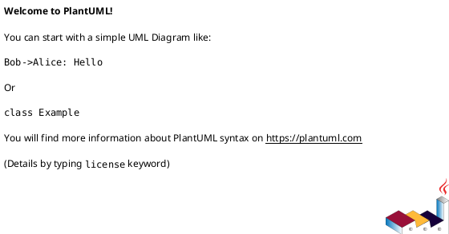

# Diagram-W

## Overview

Use this skill to turn system descriptions, flows, architecture notes, data structures, plans, or requirements into PlantUML diagrams.

The parent agent chooses the diagram type first, then uses only the relevant subagent prompt. Do not run every diagram subagent by default.

## Operating Mode

1. Identify the diagram purpose: explanation, architecture review, workflow design, data modeling, planning, UI sketch, or troubleshooting.
2. Identify the audience: engineering, product, operations, leadership, or mixed.
3. Load [resources/plantuml-diagram-selection.md](resources/plantuml-diagram-selection.md).
4. Select the smallest useful PlantUML diagram type.
5. Load [resources/plantuml-output-rules.md](resources/plantuml-output-rules.md).
6. Use the relevant subagent prompt from `subagents/`.
7. Return one complete `plantuml` fenced code block per diagram.
8. If the user wants a persistent file, resolve the output path with repo-root [scripts/resolve-output-file.ps1](../../../scripts/resolve-output-file.ps1) using `[diagram.writer]` plus `[output.file.extensionsBySubpath]`; default to `docs/diagram/subagent/filename_yyyyMMdd_HHmm.puml`.
9. Before writing under `docs/diagram`, request explicit protected-path confirmation with path, purpose, and summary.
10. Add assumptions and rendering notes only when they help the user act.

## Resource Map

- [resources/plantuml-diagram-selection.md](resources/plantuml-diagram-selection.md): diagram type selection rules and subagent mapping.
- [resources/plantuml-output-rules.md](resources/plantuml-output-rules.md): PlantUML output contract, naming, style, and rendering guidance.

## Subagent Prompts

Use the most relevant prompt only:

- Interaction flow: [subagents/diagram-sequence-generate.md](subagents/diagram-sequence-generate.md)
- User/system goals: [subagents/diagram-usecase-generate.md](subagents/diagram-usecase-generate.md)
- Type/model structure: [subagents/diagram-class-generate.md](subagents/diagram-class-generate.md)
- Runtime examples: [subagents/diagram-object-generate.md](subagents/diagram-object-generate.md)
- Workflow/process: [subagents/diagram-activity-generate.md](subagents/diagram-activity-generate.md)
- Service/module boundaries: [subagents/diagram-component-generate.md](subagents/diagram-component-generate.md)
- Infrastructure topology: [subagents/diagram-deployment-generate.md](subagents/diagram-deployment-generate.md)
- Lifecycle/state changes: [subagents/diagram-state-generate.md](subagents/diagram-state-generate.md)
- Time-based signal behavior: [subagents/diagram-timing-generate.md](subagents/diagram-timing-generate.md)
- Project schedule: [subagents/diagram-gantt-generate.md](subagents/diagram-gantt-generate.md)
- Idea hierarchy: [subagents/diagram-mindmap-generate.md](subagents/diagram-mindmap-generate.md)
- Work breakdown: [subagents/diagram-wbs-generate.md](subagents/diagram-wbs-generate.md)
- Structured data view: [subagents/diagram-json-yaml-generate.md](subagents/diagram-json-yaml-generate.md)
- Network topology: [subagents/diagram-network-generate.md](subagents/diagram-network-generate.md)
- UI wireframe: [subagents/diagram-wireframe-salt-generate.md](subagents/diagram-wireframe-salt-generate.md)
- Enterprise architecture: [subagents/diagram-archimate-generate.md](subagents/diagram-archimate-generate.md)
- Entity relationship or IE notation: [subagents/diagram-er-ie-generate.md](subagents/diagram-er-ie-generate.md)
- Grammar or regular expressions: [subagents/diagram-grammar-generate.md](subagents/diagram-grammar-generate.md)

## Output Format

```text
Diagram type:
Output file:
Assumptions:



Render:
Rui ro / ghi chu:
```

## Quality Gate

- The PlantUML block must be complete and renderable.
- Every participant, component, class, state, or entity name must come from provided context or a labeled assumption.
- Prefer readable layout over exhaustive detail.
- Avoid mixing unrelated diagram concerns in one diagram.
- Persistent diagram files must use `docs/diagram/subagent/filename_yyyyMMdd_HHmm.puml` unless the user explicitly asks for another path.
- Because `docs/` is protected, never create or update a diagram file without explicit confirmation.
- If the user asks for visual rendering, provide PlantUML server/local render instructions unless a render command was actually run.
